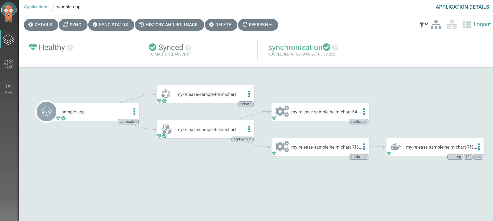

# ArogCD

## デプロイするとき
namespace=argocdを作成する

## 他のクラスターにデプロイするとき
Registers a cluster's credentials to Argo CD.

## argocdがいるクラスターと同じとこにデプロイするとき
https://kubernetes.default.svc should be used as the application's K8s API server address.

## argocd にcontextを渡す
```bash
argocd cluster add minikube
```
The above command installs a ServiceAccount (argocd-manager),
into the kube-system namespace of that kubectl context,
and binds the service account to an admin-level ClusterRole.
Argo CD uses this service account token to perform its management tasks (i.e. deploy/monitoring).
指定されたコンテキストのkube-systemに，
admin-levelのクラスターロールをargocd-managerにバインドする

```result
INFO[0000] ServiceAccount "argocd-manager" created in namespace "kube-system"
INFO[0000] ClusterRole "argocd-manager-role" created
INFO[0000] ClusterRoleBinding "argocd-manager-role-binding" created, bound "argocd-manager" to "argocd-manager-role"
```

## create app
```
argocd create app [appname] ...
```
このコマンドを打っても作るだけでデプロイはしない(outofsync)

## argocd app sync guestbook
このコマンドは
マニフェストファイルをgithubからとってきて，kubectl applyを適応する

## configmap/argocd-cm
argocdの基本的なconfigmapを含む
minikubeにを使ってやったとき特に大したことは書かれていなかった
helmのrepositoryとか置ける

## configmap/argocd-rbac-cm
argocdのrbacの設定を含む
minikubeにを使ってやったとき特に大したことは書かれていなかった

## configmap/argocd-tls-certs-cm
github.comのprivateリポジトリを持ってくるときに設定しそう，
秘密鍵とか指定する
[sample](https://argoproj.github.io/argo-cd/operator-manual/argocd-ssh-known-hosts-cm.yaml)

## configmap/argocd-ssh-known-hosts-cm
known_hostsを設定する
github.comとかの設定をする
[sample](https://argoproj.github.io/argo-cd/operator-manual/argocd-ssh-known-hosts-cm.yaml)

## sample application yaml
[sample](https://github.com/argoproj/argo-cd/blob/master/docs/operator-manual/application.yaml)
